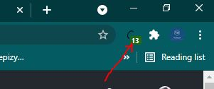

<h1>  Chrome-Extension-C-Enabler</h1>

- It Is A Huge Time-Saver! �︎

�︎
- Use This Extension, Spellcheck && AutoComplete Will Be Back!
- Works Perfectly With Every Website. 100% Compatible.
- It Even shows How many <b>stuff</b> is fixed]

Just install and no website can stop your Autocomplete.
After Installation, User-Experience Of A Lot Of Websites Will Be Massively-Improve,
With Enabled AutoComplete Menu, And Spell-Error Checking On Text-Input Elements Across The Whole Page!

